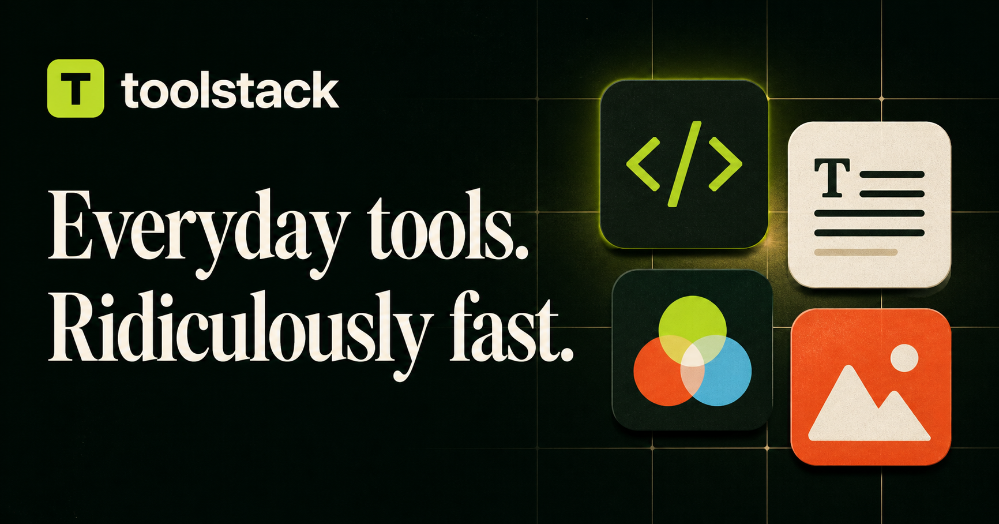

# Toolstack

**19 practical tools. One private browser workspace.**

[**Open the live app →**](https://toolstack-lovat.vercel.app) · [Browse the tools](https://toolstack-lovat.vercel.app/#tools)

Format JSON, convert images, merge PDFs, generate passwords, and finish everyday tasks without an account or file uploads.



## What you can do

| Workspace | Working features |
| --- | --- |
| Developer tools | JSON formatting and validation, UTF-8 Base64, URL encoding, UUID v4 batches, SHA-256/384/512 hashes, regex matching |
| Writing tools | Word and character counts, reading time, eight case conversions, placeholder paragraphs |
| Converters | HEX/RGB/HSL, Unix seconds and milliseconds, signed binary/octal/decimal/hex integers without precision loss |
| Passwords | Cryptographic randomness, selectable character types, long word-based passphrases, copy to clipboard |
| Images | WebP compression, PNG/JPEG/WebP conversion, plain-background removal with adjustable edges |
| PDFs | Images to PDF, merge and reorder documents, extract selected pages and ranges |

Search with **Ctrl/Cmd + K**, filter by category, save favorites, reopen recent tools, and switch between light and dark themes. Preferences stay on the current browser.

## Try these workflows

1. **JSON Formatter:** paste JSON, format or minify it, and copy the result. Invalid input produces a clear error.
2. **PDF Merger:** select two documents, arrange their order, and download one combined PDF.
3. **Image Converter:** choose a PNG, switch to JPEG or WebP, adjust quality, and download the result.
4. **Number Base Converter:** try `0`, a negative hexadecimal value, or an integer larger than JavaScript's safe-number range.

## Run locally

Requires **Node.js 22.13+** and npm.

```bash
git clone https://github.com/hasan1470/Toolstack.git
cd Toolstack
npm ci
npm run dev
```

Open [localhost:3000](http://localhost:3000). No database, API keys, or external storage services are required.

```bash
npm run test:unit  # Regression checks for parsing, storage and password generation
npm run lint      # ESLint
npm run build     # Production build and TypeScript checks
npm start         # Serve the production build
```

## How it works

Built with **Next.js 16, React 19, TypeScript, Tailwind CSS 4, and pdf-lib**. File operations run locally using browser Canvas and PDF APIs; randomness and hashing use Web Crypto. PDF code loads when a PDF tool is used.

```text
app/                         Routes, metadata, sitemap and global styling
components/HomeClient.tsx    Search, categories, favorites and theme
components/ToolWorkspace.tsx The 19 interactive workspaces
lib/tools.ts                 Tool catalog
lib/tool-utils.ts            Validated conversions, page parsing and safe preferences
tests/                       Regression tests
```

## Deployment

Import this repository into Vercel and keep the detected **Next.js** defaults. No paid database or API is needed. Vercel supplies the production domain for metadata and the sitemap. For a custom domain, set `NEXT_PUBLIC_SITE_URL` to its full HTTPS URL and redeploy.

## Practical limits

- Background removal works best on a plain, evenly lit background; it is a color-based operation, not AI subject segmentation.
- PDF tools do not accept password-protected PDFs. Large files depend on available browser memory.
- Image compression outputs WebP and limits the longest edge to 1,800 pixels. JPEG conversion uses a white background for transparency.
- Preferences are device-local. The app does not provide cloud accounts or cross-device synchronization.
- The compact passphrase dictionary uses at least 16 words; character mode produces shorter passwords.

Created by [Abdullah Hasan](https://github.com/hasan1470).
